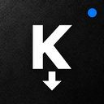
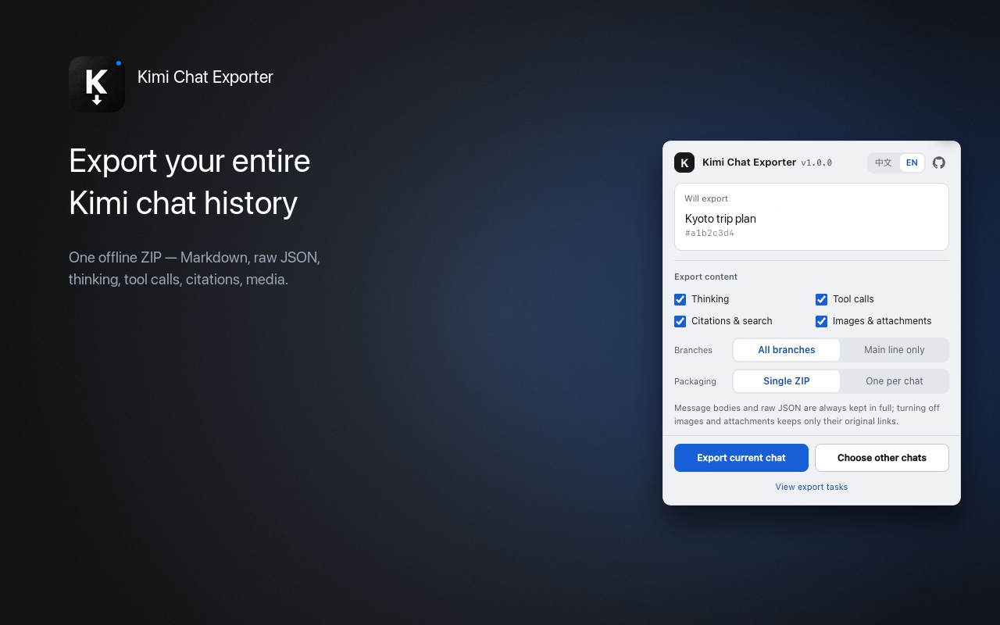

<div align="center">



# Kimi Chat Exporter


[English](README.md) · 中文

</div>

这是一个非官方的 Chrome 扩展：把 Kimi 网页版（`www.kimi.com`）的全部历史对话导出成一个自包含、可离线保存的 ZIP——Markdown 正文、原始 JSON、图片、附件与 PPT——所有处理都在本机完成；与 Kimi / 月之暗面无关，也未获其背书。



## 特性

- **一个归档装下全部**：Markdown 正文、原始 JSON，以及图片、附件、PPT 等媒体。
- **不丢内容**：思考过程、工具调用、搜索结果、引用与「重新生成」的分支都会保留。
- **可中断续传**：关闭标签页、重启浏览器甚至崩溃后都能继续，已完成的部分不会重复下载。
- **故障隔离**：单个条目失败只记录日志、不中止导出；体积过大时自动切卷。
- **使用简单**：一键导出当前对话、任意选择或全部对话；无构建步骤、零依赖。

## 安装

> 本仓库不需要打包或转译，仓库本身就是扩展。可以克隆代码，也可以从 [最新 Release](https://github.com/micooz/kimi-chat-exporter/releases/latest) 下载 ZIP 包。

1. 二选一获取文件：
   - **克隆仓库**：`git clone https://github.com/micooz/kimi-chat-exporter`。
   - **下载 ZIP**：在 [最新 Release](https://github.com/micooz/kimi-chat-exporter/releases/latest) 页下载 `kimi-chat-exporter-v<版本号>.zip` 并解压。
2. 打开 `chrome://extensions`，开启右上角「开发者模式」。
3. 点「加载已解压的扩展程序」，选择本仓库根目录（克隆）或解压出来的文件夹。
4. 打开并登录 [kimi.com](https://www.kimi.com/)。
5. 点击工具栏上的扩展图标开始导出。

## 使用

> 需要 Chrome 127 或更高版本。

1. **先确认登录**：在手边浏览器里登录 kimi.com。扩展只借用内存中的登录态，不写回、不落盘。
2. **选择范围**：弹窗默认展示当前对话；「选择其他对话」里可搜索标题、全选或勾选任意对话。
3. **选择选项**：思考过程 / 工具调用 / 引用搜索 / 下载图片附件，分支范围与打包方式。
4. **保持任务页打开**：导出在任务页执行并显示进度。关掉也只是暂停，进度已保存，回来点「继续」即可。
5. **保存产物**：完成后点「下载」，ZIP 交给浏览器下载管理器保存。

## 归档结构

```
kimi-export-2026-10-01/
├── markdown/
│   └── 2026-09-30-对话标题_<对话ID>.md
├── raw/
│   └── <对话ID>.json                   # 未经改动的原始响应
├── assets/
│   └── <对话ID>/
│       └── <hash16>-<文件名>
├── report.md                           # 统计、选项与错误汇总
└── error.log                           # 逐条错误（无错误时为空文件）
```

## 工作原理

一次导出由三层协作完成：扩展的 service worker 处理短请求（读取登录态、列出对话），任务页负责发起并展示实时进度，Web Worker 承担实际工作——分页读取消息、下载媒体、打包 ZIP。同一时间只跑一个导出，进度会持续写入检查点，所以关闭标签页或重启浏览器都不会丢失已完成的部分。

对话很多时，弹窗会把你自己的对话列表缓存在本地，打开即显示，之后增量刷新，并周期性全量刷新以剔除已删除的对话。缓存中不包含你的登录令牌。

## 权限与隐私

> 登录令牌只在内存中流转：不落盘、不写日志、不发送给开发者或任何第三方。导出全部在本机完成，产物既不依赖网络，也不依赖本扩展。

| 权限 | 用途 |
| --- | --- |
| `storage` | 保存导出选项与任务进度 |
| `downloads` | 保存生成的 ZIP |
| `scripting` | 页面辅助脚本不可用时，读取你的 kimi.com 登录态 |
| `contextMenus` | 在 kimi.com 页面提供右键导出入口 |
| `https://www.kimi.com/*`、`https://*.kimi.com/*` | 以你的登录态请求你自己的对话数据 |
| `<all_urls>`（可选） | 下载 CDN 上的媒体；用户拒绝时导出继续，媒体仅保留原始链接 |

## 开发

```sh
npm test                                                  # 全部测试（node --test "test/*.test.mjs"）
node --test test/full-export.test.mjs                     # 只跑单个文件
node --test --test-name-pattern "分支" test/*.test.mjs     # 按测试名过滤
npm run pack                                              # 生成 dist/kimi-chat-exporter-v<version>.zip
```

## License

MIT
